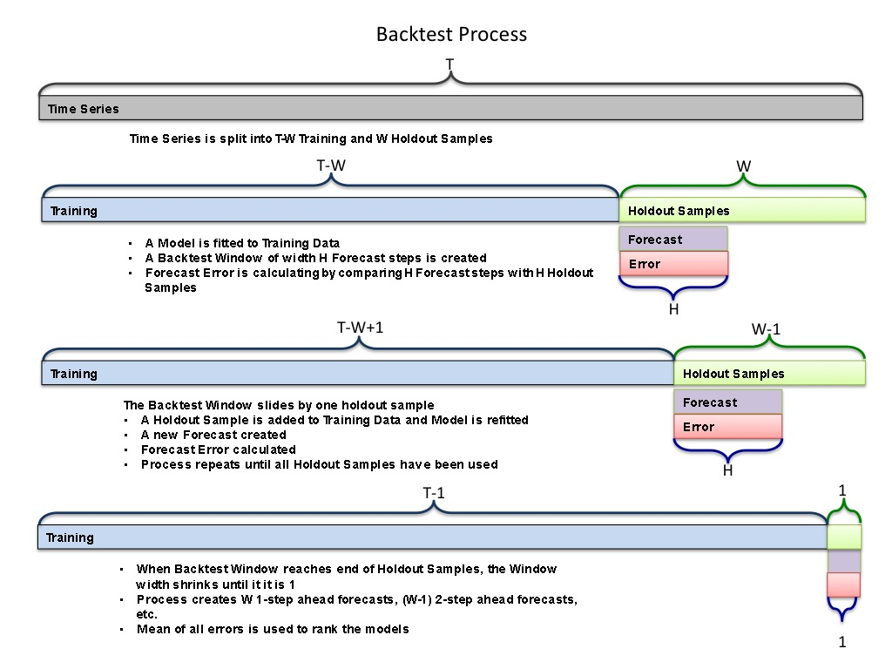

# Referential Universal Digital Indexer (RUDI) Forecasting Demonstration

This is a demonstration of my capstone team project for the Master's in Predictive Analytics program at Northwestern University. Fans of "The Jetsons" cartoon may recognize the name we chose for our forecasting system. The capstone project automatically analyzed and forecasted product shipments for a hierarchy of time series representing inventory data for a consumer packaged goods company. The hierarchy consisted of 140 individual products organized into 50 product groups, for a total of 191 time series. The team's system improved upon the company's internal SAP based forecasting system by a savings of approximately $1.1 Million over 6 months.

## The Team

### Susan Chauhan

Industry Expert & Data Visualization Specialist

Susan has more than 20 years of business experience including marketing, forecasting, and supply chain management in both professional and CPG industries. She holds a BS in electrical engineering from University of Illinois, a MBA in Marketing Management from DePaul University Kellstadt School of Business, and a MS in Predictive Analytics from Northwestern University.

### Mark Heiple

Software Engineering Expert

Mark has over 25 years of experience designing security and encryption software systems for various government agencies. He holds a BS in electrical engineering from the Rose-Hulman Institute of Technology and a MS in Predictive Analytics from Northwestern University. Mark’s roles are EDA, building predictive models, and software development.

### Priya Menon

Data scientist and Analytics Professional

10 years of research, teaching and industry experience. Worked in various roles from operations research, retail, banking and marketing analytics. Priya has a M.S in Statistics from Mangalore University (India) and a MS in Predictive Analytics from Northwestern University. Priya’s roles include EDA, modeling and forecasting.

### Sally Payne

Predictive analytics professional with 10 years experience in database marketing.

Sally has a B.A. in economics from the University of Chicago and MS in Predictive Analytics from Northwestern University. Team responsibilities include EDA, model building, documentation.

## RUDI Processing

RUDI generates forecasts by running each individual time series through a suite of modeling methods. Backtesting is used to calculate the Mean Absolute Percent Error (MAPE) of forecasts for each method. The three models with the lowest MAPE are saved. Finally the forecasts for the top three models are reconciled to account for the hierarchy.

### Modeling

RUDI uses the following modeling methods:

|Model | Description|
|:--------------------|:----------------------------------------------------------------------------|
|ETS|Error, Trend, and Seasonal state space model. This is an exponential smoothing method that combines equations for forecasting Error, Trend, and Seasonality.|
|ARIMA|Models autocorrelations in the data. This combines autoregressive (AR) terms with moving average (MA) terms as a linear model.|
|THETAM|Performs a multiplicative seasonal adjustment, then fits an exponential smoothing model.|
|NNETAR|A feed forward neural network with a single hidden layer and lagged values of the time series as inputs.|
|TBATS|Combines Box-Cox transformation, ETS smoothing of Trend and Seasonal components, and ARMA modeling of errors.|
|STLM|Seasonal and Trend decomposition. The seasonally adjusted data is forecasted, then recombined with the season. The seasonally adjusted data can be forecasted using a variety of techniques (ETS, ARIMA, NAIVE, RWF).|
|TSLM|Time Series Linear Model. The series is treated as the dependent variable, with synthesized trend and season variables as the predictors of a multiple linear regression model.|
|SNAIVE|The forecasted value is the same as the previous value of the same season.|
|NAIVE|The forecasted value is the same as the last value|
|MEAN|The forecasted value is the mean of the previous values|
|RWF|The forecasted value is the same as the last value, plus a trend component (drift) based on previous values|
|BSTS|Bayesian structural time series. Attempts to relate equations describing observed variables to unobserved latent variables and models the relationship.|
|ARIMA with Fourier Seasonal Component|ARIMA model with the seasonal component represented as Fourier series and modeled as regression components.|
|ARIMA + Random Forest|Combines ARIMA model of trend, Random Forest model of detrended series (including the seasonal component).|
|Bagging|Bootstrap Aggregation of all models.|
|Ensembles|All of the model forecasts are averaged 2 and 3 at a time, keeping the best.|

Bootstrapping is a technique where the time series is decomposed into its Season, Trend, and Remainder components. The Remainder is sliced into blocks. The blocks are then randomly sampled and recombined with the Season and Trend. A model is fitted to this Bootstrapped series. The Bootstrap process is repeated __M__ times, generating __M__ different forecasts. The forecasts are then Aggregated together by averaging them.

Each model is tested for a range of seasonal periods, including no seasonal periods.

### Backtesting

Backtesting is performed by reserving a fixed number of values from the end of the series (the holdout samples). A model is fitted to the data minus the holdout samples. A forecast horizon of width __H__ is then generated and error calculated against the corresponding __H__ holdout samples. The process is repeated by adding one holdout sample to the series and refitting the model. Another forecast is created and error calculated. This process repeats until the backtesting process has used all of the holdout samples. The overall mean error from the backtesting is used to rank the models.

### Reconciliation

Reconciliation is a process by which forecasts in the hierarchy are revised so that forecasts lower in the tree, when aggregated, match forecasts higher in the tree. RUDI uses Optimal Combination, where forecasts are generated for all levels of the hierarchy and a process similar to linear regression is used to adjust all levels simultaneously. This method is described further in the book [__Forecasting: Principles and Practice__](https://www.otexts.org/fpp/9/4 ).

## Changes in Scope for Demo

The original project required extensive computer resources, therefor this demonstration reduces scope in order to produce forecasts in a reasonable amount of time:

* A shiny app was created to allow users to upload CSV files for processing.
* Processing is limited to a single time series rather than an entire hierarchy.
* The time series is limited to 1000 values.
* Hierarchy reconciliation is not performed.
* Forecasts for all of the models are returned, rather than just the top three.
* A report is automatically generated using R Markdown and the knitr package.
* Some of the more time consuming or less effective modeling methods have been removed.

|Removed Models|
|:-------------|
|STLM|
|BSTS|
|THETAM|
|NNETAR|
|RWF|
|TSLM|
|STLM (All except ARIMA forecasting of trend)|
|All bagging methods except for ARIMA and ETS|

## System Diagram

The RUDI demo is separated into two major components. The front end is an R Shiny App, and is hosted by R Shiny Server, running on an Ubuntu Server instance on Amazon Web Services. The back end performs all of the modeling, and is running on a home PC. Redis Server is used to communicate between the front and back ends.

## The Demo

The RUDI demo presents an **[Upload]** button, which uplooads a CSV file as input. It must be formatted with the data in columns. After a CSV file is uploaded, the rest of the options appear:

* The TIME SERIES column is the column to model.

* The DATE column is optional.

* Up to two seasonal periods can be defined, a value of 1 means no season. Seasonal periods are much more processor intensive than no seasons. Big seasonal periods are more processor intensive than short periods.

* Backtest Holdout Samples - The number of holdout samples for backtesting. The number of holdout samples is limited to 6. Large numbers of holdout samples greatly increases the processing required.

* Backtest Window Size - The number of steps forecasted for each backtest step.

* Forecast Horizon (defaults to 1) - The number of out of sample steps to forecast. Short forecast horizons don't look very interesting.

* Number of Steps in Horizon - The number of steps to forecast. This defaults to 1, which isn't very interesting. 

Note that RUDI does not preserve models. Any changes, including the Forecast Horizon, requires RUDI to re-run all of the models.

The **[Forecast]** button starts processing the data. When it completes the **[Download Results]** button appears. This downloads a zip file containing a report and forecasts as CSV files.

